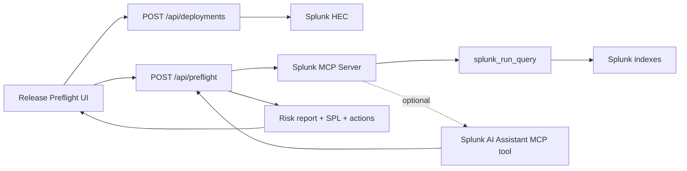

# Release Preflight Architecture

## Boundaries

- Browser code never receives Splunk tokens.
- Server routes read Splunk credentials from environment variables.
- HEC ingestion and MCP calls are separate clients under `src/lib/splunk`.
- Report scoring uses only rows returned by Splunk searches.
- AI narrative uses only the current request and Splunk query results.

## Runtime Flow

1. User enters service, environment, release ID, repository, branch, commit, and lookback window.
2. Optional deployment marker is sent to Splunk HEC.
3. `/api/preflight` builds three SPL searches: summary, errors, and recent evidence.
4. Splunk MCP executes `splunk_run_query`.
5. If available, the AI Assistant MCP tool receives the returned rows and produces a release decision narrative.
6. Release Preflight returns risk score, verdict, metrics, evidence, remediation actions, and exact SPL.

## Failure Model

- Missing env vars return server errors with explicit variable names.
- Failed MCP searches fail the run.
- Failed HEC ingestion fails the deployment marker request.
- Failed AI tool calls fail the analysis only when `RELEASE_PREFLIGHT_REQUIRE_AI=true`.
- When `RELEASE_PREFLIGHT_REQUIRE_AI=false`, the narrative is deterministic and still uses only Splunk-returned rows. It does not fabricate evidence.

## Key Files

- `src/app/page.tsx` - primary UI and workflow state.
- `src/app/api/preflight/route.ts` - Splunk MCP analysis route.
- `src/app/api/deployments/route.ts` - Splunk HEC ingestion route.
- `src/lib/splunk/mcp.ts` - MCP JSON-RPC tool client.
- `src/lib/splunk/hec.ts` - HEC event sender.
- `src/lib/preflight/spl.ts` - SPL builders.
- `src/lib/preflight/report.ts` - evidence scoring and report assembly.
